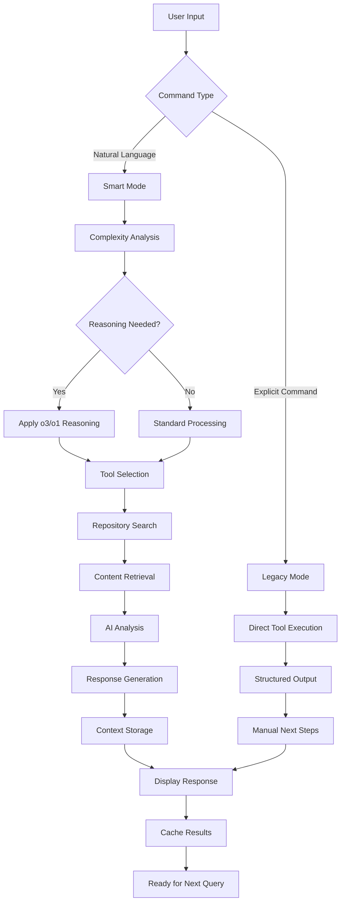

# AI CLI - Intelligent Code Assistant

A sophisticated command-line tool that combines multiple AI providers (OpenAI, Claude, Azure OpenAI, Ollama) with advanced reasoning capabilities and seamless GitHub/GitLab integration for intelligent code analysis and assistance.

## 🚀 Features

- **Dual CLI Modes**: Simple `ai` interactive mode + full-featured `ai-cli` commands
- **Advanced AI Reasoning**: Automatic o3/o1 model reasoning for complex queries
- **Multi-Provider Support**: OpenAI (GPT-4, o3, o1), Claude, Azure OpenAI, Ollama
- **Smart Code Analysis**: RAG system prioritizing your own repositories
- **MCP Integration**: Direct GitHub/GitLab repository access and search
- **Intelligent Tool Calling**: AI automatically uses appropriate tools
- **Streaming Responses**: Real-time response generation
- **Context-Aware**: Automatic git repository and user detection

## 📦 Installation

### Prerequisites
- Python 3.9+ 
- Git (for repository context detection)
- API keys for desired AI providers

### Setup Steps

```bash
# 1. Clone repository
git clone https://github.com/yourusername/ai-cli.git
cd ai-cli

# 2. Create virtual environment
python -m venv venv
source venv/bin/activate  # On Windows: venv\Scripts\activate

# 3. Install package
pip install -e .

# 4. Verify installation
ai --version
ai-cli --version
```

### Development Installation

```bash
# Install with development dependencies
pip install -e ".[dev]"

# Run tests
pytest

# Code quality checks
black ai_cli/
ruff check ai_cli/
mypy ai_cli/
```

## 🎯 Quick Start

### Method 1: Smart Interactive Mode (Recommended)

```bash
# Launch intelligent assistant
ai

# The AI will automatically:
# - Detect your current repository
# - Search your code when relevant
# - Apply advanced reasoning for complex queries
# - Use appropriate tools based on your questions

# Example queries:
# "How does authentication work in this project?"
# "Find all TODO comments and prioritize them"
# "Explain the architecture of this codebase"
```

### Method 2: Direct Commands

```bash
# Quick chat
ai-cli chat "Explain async programming in Python"

# With specific provider
ai-cli chat "Review this code for security issues" --provider claude

# Stream long responses
ai-cli chat "Write a comprehensive API documentation" --stream
```

## 🛠️ Terminal Commands Reference

### Two Entry Points

| Command | Description | Use Case |
|---------|-------------|----------|
| `ai` | Smart interactive mode | Daily development, code analysis |
| `ai-cli` | Full CLI with explicit commands | Scripting, automation, specific tasks |

### Core Commands (Both CLIs)

#### Chat Commands
```bash
# Basic chat
ai-cli chat "Your question here"
ai-cli chat "Your question" --provider claude --stream --max-tokens 2000

# Options:
--provider, -p     # AI provider: openai, claude, azure_openai, ollama
--model, -m        # Specific model (e.g., gpt-4, claude-3-sonnet)
--stream, -s       # Enable streaming responses
--max-tokens       # Maximum response tokens
--temperature, -t  # Creativity level (0.0-1.0)
```

#### AI Provider Management
```bash
# List all providers and their status
ai-cli providers

# Shows:
# - Connection status
# - Available models
# - Current configuration
```

#### Configuration Management
```bash
# Show current configuration
ai-cli config --show

# Edit configuration file
ai-cli config --edit

# Initialize new configuration
ai-cli config --init
```

#### MCP (Model Context Protocol) Commands
```bash
# Connect to GitHub/GitLab
ai-cli mcp connect github --token ghp_your_token_here
ai-cli mcp connect gitlab --token glpat_your_token_here

# Search code repositories
ai-cli mcp search github "authentication middleware" --owner myorg --repo webapp
ai-cli mcp search gitlab "database connection" --owner team --repo backend
```

#### Global Options
```bash
# Available for all commands
--config-dir PATH    # Custom configuration directory
--verbose, -v        # Enable verbose logging
--version           # Show version information
--help              # Show help information
```

## 🤖 Interactive CLI Modes

### Smart Interactive Mode (`ai` command)

**Intelligent assistant that automatically uses tools based on your queries**

```bash
# Launch smart mode
ai

# Available interactive commands:
/clear              # Clear conversation history
/context            # Show current context and cached data
/help               # Show developer help and setup
/exit               # Exit application

# Example interactions:
# User: "How does authentication work in this project?"
# AI: [Automatically searches your repo, analyzes auth code, provides detailed explanation]

# User: "Find all performance bottlenecks"
# AI: [Searches for performance patterns, analyzes code, suggests optimizations]
```

**Features:**
- **Automatic Tool Selection**: AI chooses appropriate tools
- **Advanced Reasoning**: Uses o3/o1 models for complex queries
- **Repository Prioritization**: Searches your own code first
- **Context Awareness**: Remembers previous interactions
- **Git Integration**: Detects current repository automatically

### Legacy Interactive Mode

**Command-based interface for explicit control**

```bash
# Access through ai-cli or ai with legacy flag
ai-cli interactive

# Available commands:
/setup [provider]              # Configure AI providers
/mcp [status|add|remove|test]  # Manage repository connections
/search <service> <query>      # Direct code search
/local <query>                 # Search local codebase
/view <service> <path>         # View specific files
/analyze <service> <question>  # AI-powered analysis
/providers                     # Show provider status
/config                        # Show configuration
```

## 🔧 Available Tools

### AI Tools (Auto-called in Smart Mode)

| Tool | Description | Usage Example |
|------|-------------|---------------|
| `search_code` | Search repositories with NLP optimization | Finds relevant code automatically |
| `view_file` | Retrieve complete file contents | Gets file content for analysis |
| `analyze_code_context` | Analyze code patterns and architecture | Provides insights on code structure |
| `advanced_reasoning` | Apply sophisticated reasoning | Used for complex technical questions |

### Provider Tools

| Provider | Models | Special Features |
|----------|---------|------------------|
| **OpenAI** | GPT-4, GPT-4-turbo, o1-mini, o1, o3-mini, o3 | Advanced reasoning, function calling |
| **Claude** | Claude-3 family | Large context, analytical reasoning |
| **Azure OpenAI** | Enterprise GPT models | Custom deployments, enterprise features |
| **Ollama** | Llama2, local models | Local processing, privacy |

### MCP Integration Tools

| Service | Capabilities | Authentication |
|---------|--------------|----------------|
| **GitHub** | Code search, file access, repository listing | Personal access token |
| **GitLab** | Project search, file retrieval, custom instances | Personal access token |

## 📊 Interactive CLI Process Flow



## ⚙️ Advanced Reasoning System

### Reasoning Modes (Automatic Selection)

| Mode | Description | Use Cases |
|------|-------------|-----------|
| **Step-by-Step** | Systematic problem breakdown | Complex algorithms, debugging |
| **Chain-of-Thought** | Logical progression analysis | Code review, architecture decisions |
| **Tree-of-Thought** | Multi-path exploration | System design, optimization |
| **Metacognitive** | Thinking about thinking | Learning, knowledge synthesis |
| **Socratic** | Question-guided discovery | Understanding existing code |
| **Analytical** | Framework-based analysis | Security review, performance audit |

### Complexity Detection

| Level | Criteria | Model Selection |
|-------|----------|-----------------|
| **Simple** | Basic queries, syntax questions | Standard GPT-4 |
| **Moderate** | Implementation questions | GPT-4-turbo |
| **Complex** | Architecture, design patterns | o1-mini |
| **Expert** | System design, optimization | o3-mini/o3 |

### Model Optimization

- **o3/o1 Models**: Advanced reasoning with specialized prompts
- **Claude Models**: Analytical and socratic reasoning
- **GPT-4 Models**: General purpose reasoning
- **Automatic Selection**: Based on query complexity and model capabilities

## 🔐 Configuration

### Provider Configuration

Create `~/.config/ai-cli/config.yaml`:

```yaml
providers:
  openai:
    api_key: "sk-your-openai-key"
    model: "o3-mini"  # Default model with reasoning
    
  claude:
    api_key: "sk-ant-your-claude-key"
    model: "claude-3-sonnet-20240229"
    
  azure_openai:
    endpoint: "https://your-resource.openai.azure.com/"
    api_key: "your-azure-key"
    deployment_name: "gpt-4"
    
  ollama:
    base_url: "http://localhost:11434"
    model: "llama2"

mcp:
  github:
    auth_token: "ghp_your-github-token"
  gitlab:
    auth_token: "glpat_your-gitlab-token"
    url: "https://gitlab.com"  # Optional: custom instance

default_provider: "openai"
```

### Environment Variables

```bash
# AI Provider Keys
export AI_CLI_OPENAI_API_KEY="sk-your-key"
export AI_CLI_CLAUDE_API_KEY="sk-ant-your-key"
export AI_CLI_AZURE_OPENAI_API_KEY="your-azure-key"

# Repository Access
export AI_CLI_GITHUB_AUTH_TOKEN="ghp_your-token"
export AI_CLI_GITLAB_AUTH_TOKEN="glpat_your-token"

# Optional: Custom configuration directory
export AI_CLI_CONFIG_DIR="~/.config/ai-cli"
```

### Provider Setup Examples

#### OpenAI Setup
```bash
# Get API key from https://platform.openai.com/api-keys
ai-cli config --init
# Edit config.yaml to add your OpenAI key
```

#### Claude Setup
```bash
# Get API key from https://console.anthropic.com/
# Add to config.yaml:
# claude:
#   api_key: "sk-ant-your-key"
```

#### GitHub Integration
```bash
# 1. Generate token at https://github.com/settings/tokens
# 2. Required scopes: repo (for private repos) or public_repo
ai-cli mcp connect github --token ghp_your_token_here
```

#### GitLab Integration
```bash
# 1. Generate token at https://gitlab.com/-/profile/personal_access_tokens
# 2. Required scopes: read_api, read_repository
ai-cli mcp connect gitlab --token glpat_your_token_here
```

## 🎯 Usage Examples

### Smart Interactive Mode Examples

```bash
# Launch smart mode
ai

# Code Analysis
"How does authentication work in this project?"
"Find all TODO comments and prioritize them"
"Explain the database schema in this codebase"

# Architecture Questions
"What's the overall architecture of this application?"
"How is error handling implemented?"
"Show me the API endpoints and their purposes"

# Code Review
"Review this function for security vulnerabilities"
"Find performance bottlenecks in the search functionality"
"Check for unused imports and dead code"

# Learning and Documentation
"Explain how the payment processing works"
"Generate API documentation for this service"
"Create a deployment guide for this application"
```

### Direct Command Examples

```bash
# Quick AI Chat
ai-cli chat "Explain the difference between async and sync programming"

# Provider-Specific Queries
ai-cli chat "Review this code for bugs" --provider claude --temperature 0.2

# Streaming for Long Responses
ai-cli chat "Write comprehensive unit tests for this API" --stream --max-tokens 3000

# Repository Analysis
ai-cli mcp search github "authentication middleware" --owner myorg --repo webapp
ai-cli chat "Analyze the authentication patterns found in the search results" --provider claude

# Configuration Management
ai-cli providers  # Check provider status
ai-cli config --show  # View current configuration
```

### Automation Examples

```bash
#!/bin/bash
# Automated code review script

# Search for potential issues
ISSUES=$(ai-cli mcp search github "TODO|FIXME|HACK" --owner myorg --repo myproject)

# Analyze with AI
ai-cli chat "Prioritize and suggest fixes for: $ISSUES" --provider claude --max-tokens 2000

# Generate documentation
ai-cli mcp search github "*.py" --owner myorg --repo myapi
ai-cli chat "Generate API documentation based on these Python files" --provider openai --model gpt-4
```

## 🏗️ Architecture Overview

```
┌─────────────────────────────────────────────────────────────────┐
│                         CLI Layer                                │
│  ┌─────────────┐                    ┌─────────────────────────┐ │
│  │ ai (Smart)  │                    │ ai-cli (Full Commands)  │ │
│  └─────────────┘                    └─────────────────────────┘ │
└─────────────────────────────────────────────────────────────────┘
                                │
┌─────────────────────────────────────────────────────────────────┐
│                    Core Intelligence Layer                       │
│  ┌─────────────┐  ┌─────────────┐  ┌─────────────────────────┐ │
│  │ Reasoning   │  │ NLP Search  │  │ Context Management      │ │
│  │ Engine      │  │ Optimizer   │  │ & Caching              │ │
│  └─────────────┘  └─────────────┘  └─────────────────────────┘ │
└─────────────────────────────────────────────────────────────────┘
                                │
┌─────────────────────────────────────────────────────────────────┐
│                      Provider Layer                             │
│  ┌─────────┐  ┌─────────┐  ┌─────────────┐  ┌─────────────────┐ │
│  │ OpenAI  │  │ Claude  │  │ Azure OpenAI│  │ Ollama (Local)  │ │
│  └─────────┘  └─────────┘  └─────────────┘  └─────────────────┘ │
└─────────────────────────────────────────────────────────────────┘
                                │
┌─────────────────────────────────────────────────────────────────┐
│                    MCP Integration Layer                         │
│  ┌─────────────────────────┐    ┌─────────────────────────────┐ │
│  │ GitHub Integration      │    │ GitLab Integration          │ │
│  │ • Code Search          │    │ • Project Search            │ │
│  │ • File Retrieval       │    │ • File Access               │ │
│  │ • Repository Listing   │    │ • Custom Instances          │ │
│  └─────────────────────────┘    └─────────────────────────────┘ │
└─────────────────────────────────────────────────────────────────┘
```

### Key Components

- **CLI Layer**: Dual interface (smart vs explicit commands)
- **Intelligence Layer**: Reasoning, search optimization, context management
- **Provider Layer**: Multi-AI provider support with automatic selection
- **MCP Layer**: Repository integration for code context

## 🔒 Security & Privacy

### Token Security
- **Local Storage**: API keys stored in local config files only
- **Environment Variables**: Support for secure token injection
- **Minimal Permissions**: Use least-privilege access tokens
- **No Data Transmission**: Repository data processed locally through MCP

### Privacy Features
- **Local Processing**: Code analysis happens locally
- **No Remote Storage**: Your code never leaves your machine
- **Selective Sharing**: Only search results sent to AI providers
- **Token Rotation**: Easy token updates and management

### Recommended Token Permissions

**GitHub Token Scopes:**
- `repo` (for private repositories)
- `public_repo` (for public repositories only)

**GitLab Token Scopes:**
- `read_api` (for API access)
- `read_repository` (for repository access)

## 🧪 Development

### Project Structure

```
ai_cli/
├── cli/                 # CLI interfaces
│   ├── main.py         # Full CLI commands (ai-cli)
│   ├── app.py          # Smart interactive mode (ai)
│   ├── smart_interactive.py  # AI-powered interactive mode
│   └── interactive.py  # Legacy command-based mode
├── core/               # Core intelligence
│   ├── reasoning.py    # Advanced reasoning system
│   ├── nlp_search.py   # NLP search optimization
│   ├── context.py      # Context management
│   └── tools.py        # Tool execution system
├── providers/          # AI provider implementations
│   ├── openai_provider.py
│   ├── claude_provider.py
│   ├── azure_openai_provider.py
│   └── ollama_provider.py
├── mcp/               # MCP integration
│   ├── simple_client.py    # GitHub/GitLab client
│   ├── github_server.py    # GitHub MCP server
│   └── gitlab_server.py    # GitLab MCP server
└── utils/             # Utility functions

tests/                 # Test suite
├── unit/             # Unit tests
└── integration/      # Integration tests

docs/                 # Documentation
├── architecture.md   # Detailed architecture
├── cli-reference.md  # Complete command reference
├── installation.md   # Installation guide
├── usage.md          # Usage examples
└── mcp-integration.md # MCP setup guide
```

### Development Commands

```bash
# Setup development environment
git clone https://github.com/yourusername/ai-cli.git
cd ai-cli
python -m venv venv
source venv/bin/activate
pip install -e ".[dev]"

# Run tests
pytest                    # All tests
pytest tests/unit/        # Unit tests only
pytest tests/integration/ # Integration tests only
pytest --cov=ai_cli      # With coverage

# Code quality
black ai_cli/            # Format code
ruff check ai_cli/       # Lint code
mypy ai_cli/             # Type checking
pre-commit install       # Setup pre-commit hooks

# Build and distribution
python -m build          # Build distribution packages
pip install dist/*.whl   # Install built package
```

### Contributing

1. Fork the repository
2. Create a feature branch: `git checkout -b feature/amazing-feature`
3. Make your changes
4. Add tests for new functionality
5. Run the test suite: `pytest`
6. Commit your changes: `git commit -m 'Add amazing feature'`
7. Push to the branch: `git push origin feature/amazing-feature`
8. Submit a pull request

## 📚 Documentation

### 📋 [Complete Documentation Index](docs/index.md)
**Start here for comprehensive guides and navigation**

### Core Documentation
- **[📖 Installation Guide](docs/installation.md)** - Complete setup instructions
- **[📋 CLI Reference](docs/cli-reference.md)** - All commands with examples
- **[🚀 Usage Guide](docs/usage.md)** - Workflows and best practices
- **[🔌 MCP Integration](docs/mcp-integration.md)** - Repository integration setup
- **[🏗️ Architecture Overview](docs/architecture.md)** - System design details

### Quick References

| Topic | Link | Description |
|-------|------|-------------|
| **Setup** | [Installation](docs/installation.md) | Get started in 5 minutes |
| **Commands** | [CLI Reference](docs/cli-reference.md) | Complete command syntax |
| **Interactive Mode** | [Usage - Interactive](docs/usage.md#interactive-modes) | Smart assistant usage |
| **Code Integration** | [MCP Integration](docs/mcp-integration.md) | Connect repositories |
| **Advanced Features** | [Usage - Advanced](docs/usage.md#advanced-usage) | Power user techniques |
| **Troubleshooting** | [Installation - Troubleshooting](docs/installation.md#troubleshooting) | Common issues |

## 🤝 Contributing

We welcome contributions! Please see our [Contributing Guide](CONTRIBUTING.md) for details.

### Development Setup
1. Fork and clone the repository
2. Create a virtual environment and install dependencies
3. Run tests to ensure everything works
4. Make your changes and add tests
5. Submit a pull request

## 📄 License

MIT License - see [LICENSE](LICENSE) file for details.

## 🙏 Acknowledgments

- [Anthropic](https://anthropic.com) for Claude AI and MCP protocol
- [OpenAI](https://openai.com) for GPT models and reasoning capabilities
- [Ollama](https://ollama.ai) for local model support
- [Typer](https://typer.tiangolo.com) for the excellent CLI framework

## 📞 Support

- **GitHub Issues**: [Report bugs and request features](https://github.com/yourusername/ai-cli/issues)
- **Documentation**: [Full documentation](docs/)
- **Examples**: [Usage examples](docs/usage.md)
- **Discussions**: [GitHub Discussions](https://github.com/yourusername/ai-cli/discussions)

---

**AI CLI** - Your intelligent code assistant that understands your repositories and provides advanced AI-powered analysis and development support.